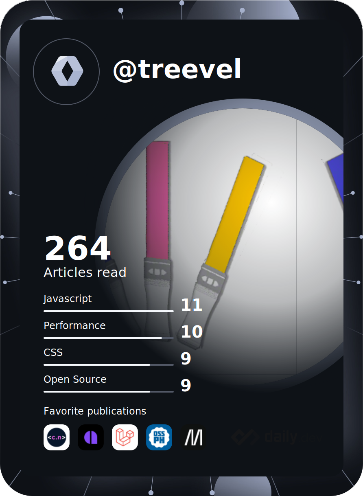

<!--
<table>
  <tr>
    <td>
      
    </td>
    <td>
      <p>### Hi there 👋</p>
      <p>**treevel/treevel** is a ✨ _special_ ✨ repository because its `README.md` (this file) appears on your GitHub profile.</p>
      <p>Here are some ideas to get you started:</p>
      <p>- 🔭 I’m currently working on ...</p>
      <p>- 🌱 I’m currently learning ...</p>
      <p>- 👯 I’m looking to collaborate on ...</p>
      <p>- 🤔 I’m looking for help with ...</p>
      <p>- 💬 Ask me about ...</p>
      <p>- 📫 How to reach me: ...</p>
      <p>- 😄 Pronouns: ...</p>
      <p>- ⚡ Fun fact: ...</p>
    </td>
  </tr>
</table>
-->

<!--START_SECTION:waka-->
📊 **This Week I Spent My Time On** 

```text
🕑︎ Time Zone: Asia/Taipei

💬 Programming Languages: 
PHP                      4 hrs 29 mins       ████████████░░░░░░░░░░░░░   49.14 % 
sh                       3 hrs 38 mins       ██████████░░░░░░░░░░░░░░░   39.70 % 
Blade Template           51 mins             ██░░░░░░░░░░░░░░░░░░░░░░░   09.46 % 
JSON                     6 mins              ░░░░░░░░░░░░░░░░░░░░░░░░░   01.26 % 
JavaScript               2 mins              ░░░░░░░░░░░░░░░░░░░░░░░░░   00.44 % 

🔥 Editors: 
VS Code                  5 hrs 31 mins       ███████████████░░░░░░░░░░   60.30 % 
Zsh                      3 hrs 38 mins       ██████████░░░░░░░░░░░░░░░   39.70 % 

💻 Operating System: 
Mac                      9 hrs 2 mins        █████████████████████████   98.72 % 
Windows                  7 mins              ░░░░░░░░░░░░░░░░░░░░░░░░░   01.28 % 
```

**I Mostly Code in Java** 

```text
Java                     3 repos             ███████░░░░░░░░░░░░░░░░░░   27.27 % 
PHP                      2 repos             █████░░░░░░░░░░░░░░░░░░░░   18.18 % 
PowerShell               1 repo              ██░░░░░░░░░░░░░░░░░░░░░░░   09.09 % 
JavaScript               1 repo              ██░░░░░░░░░░░░░░░░░░░░░░░   09.09 % 
HTML                     1 repo              ██░░░░░░░░░░░░░░░░░░░░░░░   09.09 % 
```


<!--END_SECTION:waka-->

<!-- GitHub Stats Card-->
[](https://github.com/anuraghazra/github-readme-stats)
